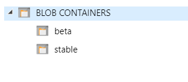

Title: 'Enabling automatic updates for sideloaded UWP apps: Multiple update channels'
Published: 04/25/2020
Tags:

 - uwp
 - devops
---
In a [previous](https://mazeez.dev/posts/update-sideloaded-uwp) post we talked about getting more control over the update process in sideloaded UWP apps. And in [another post](https://mazeez.dev/posts/uwp-devops) we talked about setting up CI/CD pipelines for UWP apps. This time we will talk about how to create multiple update channels, i.e. alpha, beta, stable, for our UWP app.

The idea is very simple, and although I am going to use Azure Blob Storage, nothing stops you from using a normal web host.

## Build Pipeline

All of the channels should use the same build pipeline. The pipeline builds and signs the UWP. I have talked about setting up a build pipeline for UWP apps [here](https://mazeez.dev/posts/uwp-devops). You don't need to change much.

## Release Pipeline

All of the magic happens in the release pipeline. We can have multiple update channels by creating multiple containers in Azure DevOps (or using different prefixes, whichever you like more) for each channel.



> Note: When creating the storage account, set the the performance tier to `Standard` (`Premium` only supports `Page Blob`s) and when creating the containers set the container access level to `Blob`.

Now for each channel, we create a stage in the release pipeline


Between each step we can have various approval processes or gates, Azure Pipelines makes these kinds of things incredibly easy.

The stages are very similar, here is what each stage has to do:


### 1. Change index.html and .installer urls

Because we now have multiple channels, each channel will have its own url. So we have to change `index.html` and the `.appinstaller` file to reflect the channels' URL. This can be done easily via a simple PowerShell script.

```powershell
Write-Host "Changing urls for beta channel..."

$oldUrl = "Old URL HERE"
$newUrl = "https://YOUR-STORAGE-ACCOUNT-HERE.blob.core.windows.net/beta"

$folder = "$(System.DefaultWorkingDirectory)/BUILD-ARTIFICAT-NAME/drop/AppxPackages"

$htmlPath = "$folder/index.html"
$installerPath = "$folder/APP-NAME.appinstaller"

((Get-Content -path $htmlPath -Raw) -replace $oldUrl,$newUrl) | Set-Content -Path $htmlPath
((Get-Content -path $installerPath -Raw) -replace $oldUrl,$newUrl) | Set-Content -Path $installerPath
```

### 2. Delete old versions to reduce cost

Although Azure Blob Storage is very cheap, UWP apps can become very large, ours is about 300 MB when compiled in `Release` configuration for both `x64` and `x86` architectures. So in order to make sure we don't store too much data, we will delete the older versions and only leave the last N versions.

For this we can use the [Azure CLI](https://github.com/microsoft/azure-pipelines-tasks/blob/master/Tasks/AzureCLIV2/Readme.md) task. It's similar to a Powershell script, but you're already logged in to your azure subscription. In the script part we can use something like this:

> Note: Azure CLI added support for PowerShell scripts in v2.

```powershell
$container = "beta"
$accountName = "STORAGE-ACCOUNT-NAME"

# Get List of blobs in the container and deserialize the list
$blobs = az storage blob list -c $container --prefix APP-NAME-HERE_ --account-name $accountName | convertFrom-json

# Create a HashTable so that we can store the name of the directory and its creation time
$dict = @{}

Foreach($blob in $blobs)
{
    $versionName = $blob | Select-Object -ExpandProperty name
    $versionName = $versionName.split("/")[0]

    $date = $blob | Select-Object -ExpandProperty properties | Select-Object -ExpandProperty creationTime
    $date = [datetime]$date

    $dict[$versionName] = $date
}

# Sort the directories by their creation time and skip the top 2 (we don't want to remove last 2 version)
$ordered = $dict.GetEnumerator() | Sort-Object -Property Value -Descending | Select-Object -Skip 2

Write-Host Deleting obsolete versions...
Foreach($blob in $ordered)
{
    # APP-NAME_1.0.1.0_Test => APP-NAME_1.0.1.0_Test/*
    $dir = $blob.Key + "/*"
    az storage blob delete-batch -s $container --pattern $dir --account-name $accountName
    Write-Host $blob.Key " - " $blob.Value
}

Write-Host Done
```

### 3. Copy the build artifact to channel container

We can use the amazingly fast [AzureBlob File Copy](https://github.com/microsoft/azure-pipelines-tasks/blob/master/Tasks/AzureFileCopyV1/README.md) task to upload the build artifact to azure blob storage. Using it is straightforward, you give it a folder to upload and the name of the container as well as the subscription and it uploads the specified files in no time.

### 4. (Optional) Upload the UWP symbols to AppCenter

This only needs to be done in the first stage. In order for AppCenter crashes to give you detailed stack traces, it needs the symbols to translate memory addresses to function and class names. You can find more [details here](https://docs.microsoft.com/en-us/appcenter/diagnostics/windows-support#symbolication).

I have used the [appcenter cli](https://github.com/microsoft/appcenter-cli) to upload the symbols.

```powershell
# AppCenter UWP symbolication
# https://docs.microsoft.com/en-us/appcenter/diagnostics/windows-support#symbolication

# Install appcenter cli
# https://github.com/microsoft/appcenter-cli
npm install -g appcenter-cli

# Login to AppCenter
appcenter login --token $env:AppCenterToken --quiet

# Get the path fo the symbol files (64 bit and 32 bit)
$symbolFiles = Get-ChildItem *.appxsym -Recurse -Force | Select-Object -ExpandProperty FullName

# Upload the symbols
Foreach($symbolFile in $symbolFiles)
{
    Write-Host "Uploading $symbolFile..."
    appcenter crashes upload-symbols --app ORGANIZATION-NAME/APP-NAME --appxsym $symbolFile
}
```

> Note: in the current version, appcenter cli seems to use some deprecated libraries. So I have set `Fail on Standard Error` to false on the Powershell task so that the task doesn't fail.
>
> Note2: I am using Azure Pipelines secrets to pass the AppCenter token to appcenter cli. For that, you have to explicitly map the secret to an environment variable in the `Environment Variables` part of the Powershell task.

Congratulations! Now you've got yourself a decent multichannel auto-update process. All that remains is to teach the UWP app to look at different `.appinstaller` files based on which update channel its listening on.